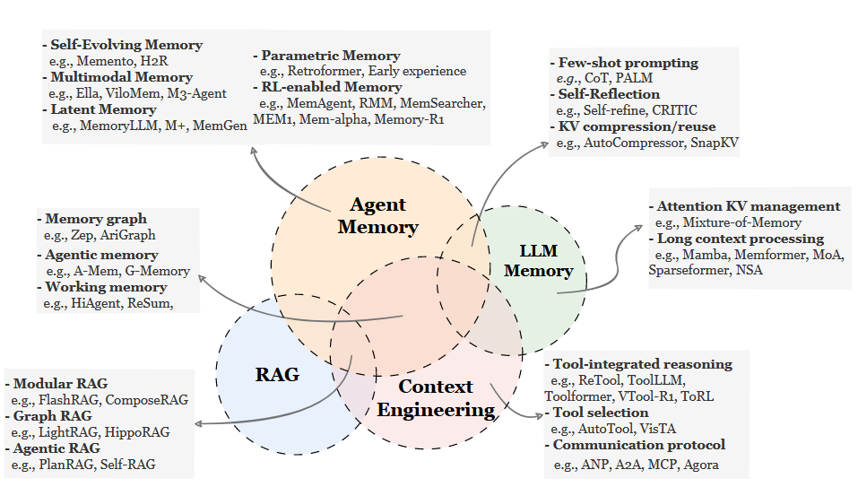
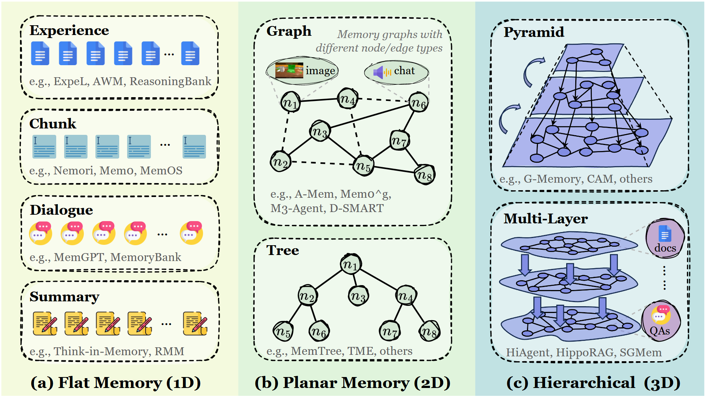
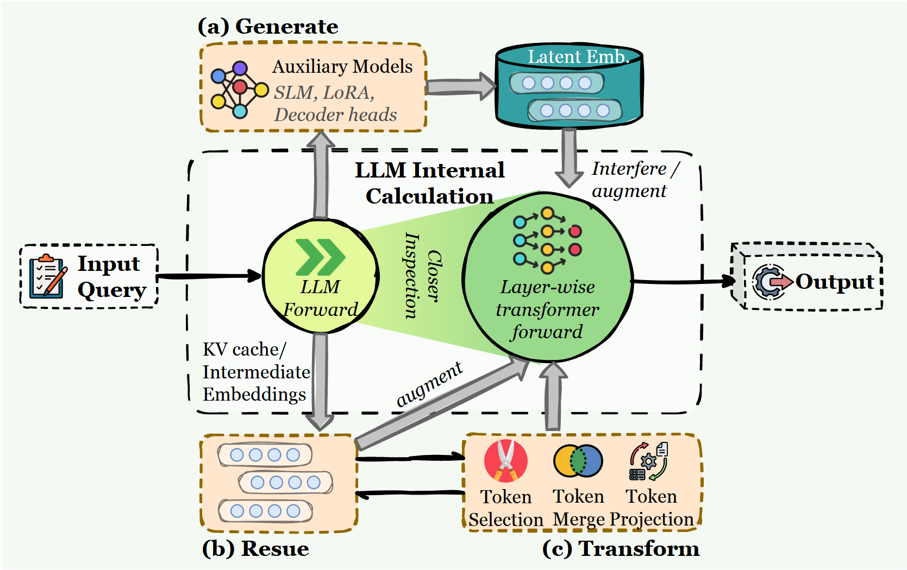
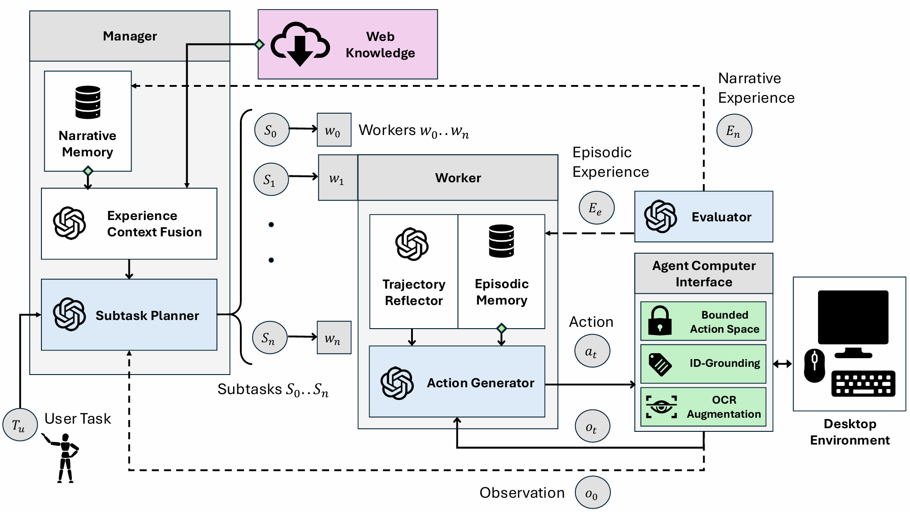

## Memory in the Age of AI Agent

| **对比维度** | **Agent Memory**                                             | **LLM Memory**                                               | **RAG**                                                      | **Context Engineering**                                      |
| ------------ | :----------------------------------------------------------- | :----------------------------------------------------------- | :----------------------------------------------------------- | :----------------------------------------------------------- |
| **核心定义** | 智能体在与环境交互中积累的、支持长期生存与适应的**认知状态**。 | 指大模型本身处理信息的**架构能力**，侧重于模型内部的参数或状态管理。 | 一种通过检索**外部静态知识库**来增强模型生成准确性的技术范式。 | 在有限的上下文窗口内，优化输入信息以提升模型表现的**方法论**。 |
| **核心目标** | **认知建模**：支持长期生存、规划、个性化                     | **架构优化**：扩展模型处理长序列的能力                       | **知识增强**：提供准确的外部静态知识                         | **资源管理**：在有限窗口内最大化信息效率                     |
| **数据性质** | **动态**：交互历史、经验、反思（自我演化）                   | **参数/状态**：模型权重、KV Cache                            | **静态**：文档、百科全书（外部导入）                         | **瞬态**：当前的 Prompt 上下文                               |

### 基于记忆的存储位置及其表征形式进行分类

**Token-level Memory：** 记忆以显式和离散的单元组织,可以单独访问、修改和重建。这些单元 保持外部可见性,并且可以随着时间的推移以结构化形式存储。

**Parametric Memory：**存储在模型参数中的记忆,其中信息通过参数空间的统计模式进行编码, 并在正向计算期间隐式访问。

**Latent Memory：**模型内部隐藏状态、连续表示或演化潜在结构中表征的记忆。它可以在推理 过程中或跨交互周期持续存在和更新,捕捉上下文相关的内部状态。

| **记忆类型** | **Token-level Memory**                                     | **Parametric Memory**                                      | **Latent Memory**                                            |
| ------------ | ---------------------------------------------------------- | ---------------------------------------------------------- | ------------------------------------------------------------ |
| **通俗理解** | “笔记本”或“外接硬盘” 写在纸上的字，或者存在硬盘里的文件。  | “大脑皮层”或“肌肉记忆” 通过学习内化为本能或知识。          | “脑海中的瞬时印象” 思考过程中那一闪而过的感觉或思维快照。    |
| **存储位置** | **外部存储** (向量数据库、文件系统)                        | **模型内部参数** (Weights, Biases)                         | **模型推理过程中的状态** (KV Cache, Hidden States)           |
| **表征形式** | **显式、离散的单位** (文本 Text、向量 Embedding、SQL 条目) | **隐式的统计规律** (神经网络的权重分布)                    | **连续的中间向量** (激活值、压缩后的语义向量)                |
| **读写特性** | **即插即用，易读写**：可以随时增删改查，对人类透明可见。   | **更新极难，读取隐式**：需要通过训练来写入，无法直接查阅。 | **推理时产生，复用高效**：通常用于加速推理或压缩长上下文，断电即失（除非专门持久化）。 |
| **优点**     | 容量几乎无限，准确性高，可解释性强。                       | 推理速度最快（因为不需要检索），知识融合得最好。           | 相比纯文本更紧凑（省 Token），保留了更多原始语义信息。       |
| **缺点**     | 检索速度随数据量增加而变慢，可能检索到无关信息。           | 更新成本极高（需要微调），容易遗忘旧知识。                 | 人类不可读，跨模型/跨版本通用性差。                          |

**Token-level Memory是目前最主流常见的记忆形式，根据记忆单元之间的拓扑结构复杂度，可细分为三个维度。**

| **子类别**   | **Flat Memory (1D)**                                         | **Planar Memory (2D)**                                       | **Hierarchical Memory (3D)**                                 |
| ------------ | ------------------------------------------------------------ | ------------------------------------------------------------ | ------------------------------------------------------------ |
| **结构形态** | **列表/序列 (List/Sequence)**：无明确的拓扑关系，就像流水账日记，一条接一条。 | **图/树 (Graph/Tree)**：存在明确的二维关系，能够捕捉单元间的关联、依赖或因果关系。 | **多层金字塔 (Pyramid/Multi-layer)**：多层面、多层次的立体结构，不同层次的记忆单元有明确的抽象关系。 |
| **组织方式** | 独立的、线性的。没有显式的关联结构。                         | 显式的单层拓扑。节点之间有链接（Link），但没有层级之分。     | 分层的。底层是原始数据，上层是抽象、总结或索引。             |
| **适用场景** | 需要快速记录、无需复杂关联的场景，比如存储任务轨迹、形成简单的用户画像。 | 需要梳理逻辑关系、支持多步推理的场景，比如知识图谱构建、因果关系链、任务依赖关系。 | 超长周期的记忆管理、需要从海量细节中提炼宏观见解的任务或对记忆进行多粒度管理的场景。 |
| **优缺点**   | **优**：简单，写入快。 **缺**：检索难，缺乏深度关联。        | **优**：能通过关系跳转检索（Multi-hop）。 **缺**：构建图的成本高。 | **优**：支持不同粒度的检索（宏观/微观），符合人类认知。 **缺**：维护复杂，更新牵一发而动全身。 |
| **具体案例** | **MemGPT**将对话记录分为“主内存”（当前上下文）和“扩展内存”（长期存储），通过“分块存储+按需加载”解决上下文窗口限制。 | **A-MEM**将记忆组织为“关联笔记”网络，每个笔记是一个离散单元，相关笔记通过链接关联。解决Flat Memory的“信息孤岛”问题。 | **HiAgent**层级工作记忆，为长期任务建立子目标层级，每个子目标对应独立的记忆单元，完成后将细节压缩为高层摘要，既保留关键信息，又节省存储资源。 |

**Parametric Memory可根据参数存储位置，分为内部参数记忆和外部参数记忆**

* **Internal Parametric Memory**
  * 编码在模型的原始参数中的记忆（如权重、偏差）。这些方法直接调整基础模型以整合新知识或行为。
  * **实现方式：**通过微调、持续预训练等方式，将记忆直接编码到LLM的原始参数中。
  * **具体案例：**CharacterGLM通过微调将特定角色的性格、说话风格编码到模型参数中，让Agent在所有交互中都能保持一致的角色表现。

* **External Parametric Memory**
  * 存储在额外的或辅助的参数集中。这些方法引入新参数来承载记忆，而无需修改原始模型权重。
  * **实现方式：**在原始模型之外，增加独立的参数模块（如Adapter、LoRA）存储记忆，不修改原始模型参数。
  * **具体案例：**K-Adapter为模型增加任务特定的适配器模块，存储该任务的相关记忆，切换任务时只需替换适配器。

**Latent Memory可根据潜在状态的来源分为生成型、复用型和转换型**

* **Generate**
  * **实现方式：**专门训练一个模型来生成记忆向量，然后作为可重用的内部表示提供给智能体。
  * **具体案例**：AutoCompressor将长文档压缩为固定长度的潜在向量，作为记忆单元，Agent需要时只需加载向量即可还原核心语义。

* **Reuse**
  * **实现方式：**直接复用模型推理过程中产生的时的中间状态（如KV Cache）。
  * **具体案例：**Memorizing Transformers将过去计算的KV缓存存储起来，遇到相似输入时直接复用，大幅提升推理速度。

* **Transform**
  * **实现方式：**对原始潜在状态进行压缩、修剪、重组，形成更高效的记忆单元。
  * **具体案例：**SnapKV通过投票机制筛选重要的KV缓存条目，去除冗余信息。

## 基于功能目标和时间跨度进行分类的智能体记忆

**分类原因：**单纯看记忆的“存储形式”无法解释智能体的行为逻辑。智能体记忆不是一个单一的模块，而是一组**为了解决特定认知问题而存在的工具集**。

**Factual Memory**

* **定义：**存储Agent在交互过程中获取的明确事实、静态知识，包括用户信息、环境状态、领域知识等，回答“是什么”的问题。
* **作用：**确保Agent的交互一致性和知识准确性，避免出现“失忆”或“幻觉”。
* **子类别**
  * **User factual memory：**记住用户的身份、习惯、历史承诺等。
  * **Environment factual memory：**记住外部世界的客观状态、规则、文档内容（例如：“数据库的密码是123456”）。

**Experiential Memory**

* **定义：**存储Agent在任务执行过程中积累的动态经验，包括成功的流程、失败的教训、总结的策略等，回答“怎么做”的问题。
* **作用：**让智能体越用越聪明，避免在同一个坑里跌倒两次，是智能体实现持续学习和自我进化的关键。
* **子类别**
  * **Case-based：**存储完整的任务轨迹、具体的解决方案、失败的场景和原因。
  * **Strategy-based：**从多个案例中提炼出的高层规则、思维模板或工作流。
  * **Skill-based：**将经验固化为可直接调用的技能、工具使用方法、代码片段。
* **Hybrid memory**
  * 单一的记忆形式都有缺陷，案例记忆太琐碎，容易受到噪声干扰；策略记忆太抽象，缺乏执行细节；技能记忆难以直接习得。
  * 将多种形式的经验记忆（原始轨迹、抽象规则、可执行代码）集成起来，试图同时实现高精度检索和强大的泛化能力。
  * **基于案例和基于策略记忆的结合：**ExpeL结合了具体的轨迹（Trajectories）和抽象的文本见解（Textual Insights）。让智能体在回忆具体方案的同时，应用通用的启发式规则。

**Working Memory**

* **定义：**在单个任务执行过程中，临时存储和处理的信息，包括当前任务状态、中间结果、待办事项等，回答“现在在做什么”的问题
* **作用：**解决 Context Window 有限的问题，防止注意力被无关信息淹没。
* **子类别**
  * **Single-turn：**处理瞬间的巨量输入，进行信息压缩和摘要。
  * **Multi-turn：**在长任务中维护当前状态，记住“我现在做到哪一步了”，防止迷失方向。

| **类别**         | **事实性记忆 (Factual)**                             | **经验性记忆 (Experiential)**                           | **工作记忆 (Working)**                                       |
| ---------------- | ---------------------------------------------------- | ------------------------------------------------------- | ------------------------------------------------------------ |
| **人类认知类比** | **陈述性记忆** (百科全书 + 日记)                     | **程序性记忆** (骑车技能 + 经验教训)                    | **工作记忆** (大脑的内存条)                                  |
| **主要目标**     | **一致性 (Consistency)** 回答准确，人设不崩。        | **进化 (Evolution)** 从错误中学习，提升解决问题的效率。 | **聚焦 (Focus)** 在有限的注意力资源下处理当前任务。          |
| **时间跨度**     | **长期 (Long-term)** 跨越多次会话，持久保存。        | **长期 (Long-term)** 跨越多次任务，不断积累。           | **短期 (Short-term)** 仅存在于当前任务或对话窗口中。         |
| **存储内容**     | 用户画像、世界知识、文档数据。                       | 成功的操作轨迹、失败的教训、代码函数。                  | 压缩后的上下文摘要、当前的状态变量。                         |
| **典型失效后果** | **“失忆/幻觉”** 忘了用户刚才说过的话，或者胡编乱造。 | **“笨拙/死板”** 反复犯同样的错误，不会举一反三。        | **“迷失/超载”** 任务做到一半忘了下一步干嘛，或者被长文本撑爆。 |

## Agent-S记忆机制

* **功能大类：**工作记忆 （Working Memory）
* **时间维度：**多轮工作记忆（Multi-turn Working Memory）
* **具体子类：**认知规划 （Cognitive Planning）——工作记忆会创建和维护一个外化的模块。状态不仅作为过去的总结而存在，更作为一个面向未来的结构，指导未来的动作。
* **记忆载体：** Token-level

 **Agent-S**是一种利用**多轮工作记忆**来支持**认知规划**的智能体，它通过维护一个层级化的计划结构，将长期知识与短期执行连接起来，以解决复杂的计算机控制（GUI）任务。

**具体实现**

1. **层级化计划 (Hierarchical Plan)**
   * Agent-S 将一个宏大的任务分解为分层的子任务树，这个计划树本身就是它的工作记忆。
   * **记录内容：**哪些子任务已经完成了（Done）、现在正在做哪个子任务（Active）、接下来要做什么（Pending）。
2. **锚定推理 (Anchoring Reasoning)**
   * 在每一步操作时，Agent-S 都会回头看这个计划记忆。通过查阅计划记忆，可以明确当前的任务，从而忽略干扰（如界面上突然有弹窗广告等）。
3. **连接长期与短期 (Bridging Long-term Knowledge with Short-term Execution)**
   * Agent-S 使用了记忆增强检索 **（Memory-augmented retrieval）**。通俗来讲就是就是Agent在干活时，根据手头工作的需要，自动从大脑深处（长期记忆）调用相关知识（经验/技能）来辅助当前决策的过程。
   * 它不仅维护当前的计划（短期工作记忆），还能根据当前子任务的需要，从长期记忆中检索相关的知识（例如之前的操作经验或领域知识），并将这些知识动态加载到当前的执行上下文中。